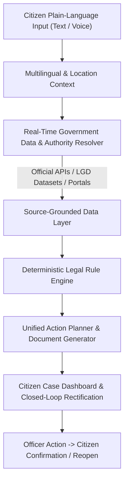

# InfoRight AI — Civic & Legal Empowerment Platform

> **Problem Statement 3**: *AI for Civic and Legal Empowerment*
> **Live Production Platform**: **[`https://inforight-ai.vercel.app`](https://inforight-ai.vercel.app)**
> **Public GitHub Repository**: **[`https://github.com/ammuelsa17-ui/inforight-ai`](https://github.com/ammuelsa17-ui/inforight-ai)**

---

## 1. Overview & Problem Statement

**InfoRight AI** bridges the gap between ordinary citizen grievances and complex statutory procedures across India.

Citizens often struggle to navigate municipal authorities, statutory dispute redressal portals, or welfare eligibility requirements due to bureaucratic jargon, ambiguous forms, and uncertain jurisdiction boundaries. InfoRight AI translates plain-language citizen problems into a clear, guided empowerment workflow across four integrated modules:

1. **RTI Drafting & Civic Navigation**: Converts civic grievances into 3–5 objective requests for certified copies of government records under Section 6(1) of the RTI Act 2005, with exact Public Authority and PIO routing.
2. **Pan-India Rights Navigator**: Guides citizens through Consumer Protection (e-Commerce), State-Specific Tenancy, and Workplace/Labour disputes with simple-language legal breakdowns, evidence checklists, statutory portal links (**e-Jagriti**, **1915 NCH**, **Shram Suvidha / CLC**), and formal legal notices.
3. **Welfare Scheme Eligibility Reader**: Evaluates citizen profiles against verified National and State welfare schemes using deterministic conditional rules (referencing **myScheme** framework).
4. **Closed-Loop Civic Rectification**: Connects citizen "before" evidence to municipal officer action and "after" rectification proof, with deterministic Haversine distance validation and citizen-only closure.

---

## 2. Integrated Platform Architecture



---

## 3. AI vs. Deterministic Legal Logic Principle

InfoRight AI strictly enforces the **Non-Delegation Principle**:
* **AI's Role**: Multilingual translation, intent classification, plain-language explanation, and natural drafting assistance.
* **Deterministic Rules' Role**: Statutory timeframes (RTI 30 days / 48 hrs), Consumer pecuniary limits (DCDRC ₹50L, SCDRC ₹2Cr, NCDRC >₹2Cr), State tenancy deposit caps (Tamil Nadu 3 months, UP 2 months), and eligibility criteria are hardcoded and versioned in deterministic TypeScript engines.
* **Zero Hallucination Guarantee**: If an authority or portal is not in an official or verified registry, the system explicitly returns `VERIFICATION_REQUIRED` rather than fabricating an answer.

---

## 4. Key Features

- **Pan-India Location & Authority Resolution**: 36 States & UTs, 700+ Districts (LGD-backed), and 6-digit Indian PIN resolver with verified fallbacks.
- **Multilingual Bharat Voice Support**: 23 Scheduled Indian Languages mapped dynamically to BCP-47 speech locales with server-side Sarvam STT (`saaras:v3`) fallback.
- **Consumer Protection Engine**: Automatically resolves territorial and pecuniary jurisdiction under CPA 2019, routing to **e-Jagriti** (`https://e-jagriti.gov.in/`) and National Consumer Helpline (**1915**).
- **State-Aware Tenancy Engine**: Applies specific enacted state laws (e.g. TNRRRLT Act 2017 in Tamil Nadu, MRCA 1999 in Maharashtra) without conflating the Model Tenancy Act as binding state law.
- **Closed-Loop Civic Rectification**: Citizen before-photo evidence → Officer assignment → Officer after-photo repair proof → Deterministic location comparison (Haversine formula) → Citizen-only confirmation or reopening cycle.
- **Strict Privacy & Zero Secret Exposure**: Identity data is stored locally in browser memory (`localStorage` / `IndexedDB`) and never transmitted to LLMs during problem drafting.

---

## 5. Technology Stack & Quality Controls

| Layer | Technologies Used | Purpose |
| :--- | :--- | :--- |
| **Framework** | Next.js 16.3.1 (App Router), React 19 | Full-stack server routes & SSR |
| **Styling & UI** | Tailwind CSS v4, Lucide Icons | Responsive civic sky & indigo theme |
| **AI & NLP** | Google Gemini 1.5 Flash, Sarvam AI (`saaras:v3`) | Drafting assistance & Multilingual STT/TTS |
| **Type Safety** | TypeScript 5 | Strict interface & contract enforcement |
| **Quality Suite**| Custom Contract Runner (`scripts/test-v2-api-contracts.ts`) | **333/333 Automated Route-Handler Tests** |
| **Deployment** | Vercel Serverless Platform | Zero-downtime global hosting |

---

## 6. Local Setup & Running Instructions

### Prerequisites
* Node.js 18.x or higher
* npm 9.x or higher

### Steps

1. **Clone Repository**:
   ```bash
   git clone https://github.com/ammuelsa17-ui/inforight-ai.git
   cd inforight-ai
   ```

2. **Install Dependencies**:
   ```bash
   npm install
   ```

3. **Configure Environment Variables**:
   Copy `.env.example` to `.env.local`:
   ```bash
   cp .env.example .env.local
   ```
   Add optional provider keys (`GEMINI_API_KEY`, `SARVAM_API_KEY`). The platform operates with built-in deterministic fallbacks even if keys are omitted.

4. **Execute Quality Suite**:
   ```bash
   npm run lint
   npm run audit:i18n
   npm run test:api
   npm run build
   ```

5. **Start Development Server**:
   ```bash
   npm run dev
   ```
   Open [http://localhost:3000](http://localhost:3000) in your browser.

---

## 7. Known Limitations

1. **Browser-Local Multi-Role Persistence**: Case data and photo evidence are stored locally in the browser (`localStorage` and `IndexedDB`). For the hackathon prototype, switching between Citizen and Officer roles simulates the complete workflow on a single device without shared cross-device cloud synchronization.
2. **Voice Microphone Testing**: Automated test runner validates all 23 language mappings and fallback pipelines (333 passing tests); physical audio capture requires a live browser with microphone permission.

---

## 8. Disclaimer

*InfoRight AI is an educational, civic, and legal literacy assistance tool. It generates draft applications and navigation guidance based on publicly available laws and government portals. It does not provide legal representation or create an attorney-client relationship. Citizens should independently verify local filing procedures with competent authorities.*
