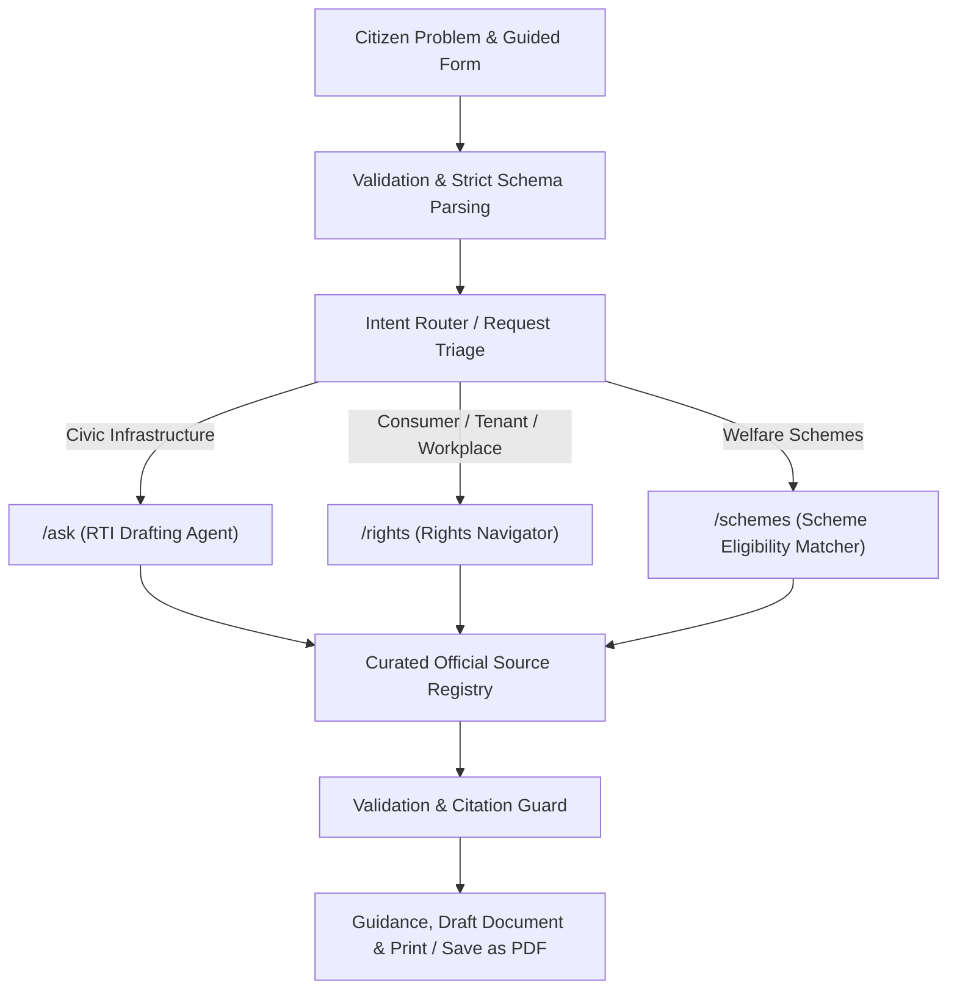

# InfoRight AI — Civic & Legal Empowerment Platform

> **Problem Statement 3**: *AI for Civic and Legal Empowerment*
> **Live Production Platform**: **[`https://inforight-ai.vercel.app`](https://inforight-ai.vercel.app)**
> **Public GitHub Repository**: **[`https://github.com/ammuelsa17-ui/inforight-ai`](https://github.com/ammuelsa17-ui/inforight-ai)**

---

## 1. Overview & Problem Statement Alignment

**InfoRight AI** directly addresses the core challenge of civic and legal empowerment by bridging the gap between ordinary citizen grievances and complex statutory procedures.

Citizens often struggle to navigate municipal authorities, statutory dispute redressal portals, or welfare eligibility requirements due to bureaucratic jargon, ambiguous forms, and uncertain jurisdiction boundaries. InfoRight AI translates plain-language citizen problems into a clear, guided empowerment workflow across four integrated modules:

1. **RTI Drafting Agent**: Converts civic road complaints into 3–5 objective requests for certified copies of government records under Section 6(1) of the RTI Act 2005.
2. **Rights Navigator**: Guides citizens through Consumer Protection (e-Commerce), Tenancy, and Workplace disputes with simple-language legal breakdowns, evidence checklists, statutory portal links (**e-Jagriti**, **1915**, **SAMADHAN 2.0**), and draft representation letters.
3. **Scheme Eligibility Reader**: Evaluates citizen profiles against verified National and Tamil Nadu welfare schemes using deterministic conditional rules (referencing **myScheme** framework).
4. **Conversational Form-Filler & Bureaucracy Translator**: Asks guided questions step-by-step to auto-populate draft applications, explain *What this means*, *What you should do now*, *Documents to collect*, *Where to submit*, and *What to do if unresolved*.

---

## 2. Integrated Platform Architecture



---

## 3. Core Technical & Privacy Architecture

### 3.1 Browser Privacy Boundary
* **Applicant Identity Separation**: Applicant identity fields (`applicantName`, `applicantAddress`, `phoneNumber`, `email`, `signature`) remain strictly in local browser state.
* **Excluded from API Payload**: Identity fields are excluded from API payloads sent to external server routes and AI services. Identity fields are merged into document templates locally in browser memory only during preview rendering and **Print / Save as PDF** export.
* **Privacy Verification**: `validation.applicantDataSentToAI === false` is returned in every response.

### 3.2 Source-Grounded Curated Registry
* Official URLs, statutory authority designations, and portal links are resolved exclusively from a bundled, curated source registry (`src/data/source-registry.ts`).
* AI generation is restricted to structured text drafting; Gemini is prohibited from inventing government URLs, PIO designations, or legal fees.

### 3.3 Rule-Based Scheme Eligibility Engine
* Scheme eligibility is evaluated deterministically against structured conditional rules. Gemini explains matching reasons but does not decide eligibility. Results are clearly designated as **potential scheme matches requiring official department confirmation**.

### 3.4 Failure Resilience & Fallback Engine
* Includes a server-side failure simulation toggle (`ENABLE_DEMO_FAILURE=true` in preview environments). If AI generation times out (>8s), fails, or returns malformed JSON, the server automatically executes a deterministic fallback engine returning pre-approved record request templates.

---

## 4. Five Mandatory Demonstration Use Cases

1. **RTI Drafting Agent (Coimbatore Road Repair)**: Converts DB Road pothole complaints into 3–5 objective requests for certified copies of estimates, Measurement Book (MB) entries, completion certificates, and expenditure statements.
2. **Consumer Dispute Navigator (Online Laptop Refund Denial)**: Provides rights summary under Consumer Protection Act 2019, escalation pathways to National Consumer Helpline (**1915**) and **e-Jagriti** portal (`https://consumerhelpline.gov.in/`), and a draft consumer representation letter.
3. **Tenant Rights Navigator (Security Deposit Recovery)**: Provides rights breakdown under Tamil Nadu Regulation of Rights and Responsibilities of Landlords and Tenants Act 2017, State Rent Authority links, explicit state-jurisdiction warnings, and a draft deposit notice letter.
4. **Workplace Rights Navigator (Unpaid Salary Settlement)**: Evaluates wage recovery options, provides links to **SAMADHAN 2.0** Conciliation Portal (`https://betasamadhaan.labour.gov.in/`), central vs. state jurisdiction warnings, and a draft employer grievance letter.
5. **Scheme Eligibility Reader (Low-Income Female Student)**: Evaluates Tamil Nadu female student profile against scheme criteria, matching `TN_POST_MATRIC_SCHOLARSHIP` and `TN_MOOVALUR_RAMAMIRTHAM_PUDHUMAI_PENN` (Pudhumai Penn Scheme) with **myScheme** discovery links (`https://www.myscheme.gov.in/`).

---

## 5. Technology Stack & Quality Controls

| Component | Technology | Role / Control Purpose |
| :--- | :--- | :--- |
| **Framework** | Next.js 16.3.1 (App Router) | Full-stack server routes & static rendering |
| **UI Library** | React 19, Tailwind CSS v4, Lucide Icons | Responsive civic sky & indigo theme |
| **AI Model** | Gemini 1.5 Flash (`gemini-1.5-flash`) | Structured application drafting assistant |
| **Language** | TypeScript 5 | Strict interface contract enforcement |
| **Testing** | Custom Contract Test Runner (`npm run test:api`) | 37/37 Route-Handler Contract & Safety Tests |
| **Deployment** | Vercel Production Hosting | Continuous deployment with server-side secrets |

---

## 6. Local Setup & Execution Instructions

### Prerequisites
* Node.js 18.x or higher
* npm 9.x or higher

### Installation Steps

1. **Clone the Repository**:
   ```bash
   git clone https://github.com/ammuelsa17-ui/inforight-ai.git
   cd inforight-ai
   ```

2. **Install Dependencies**:
   ```bash
   npm install
   ```

3. **Configure Environment Variables**:
   Create a `.env.local` file in the project root:
   ```env
   GEMINI_API_KEY=your_gemini_api_key_here
   ENABLE_DEMO_FAILURE=false
   ```

4. **Run Development Server**:
   ```bash
   npm run dev
   ```
   Open `http://localhost:3000` in your browser.

5. **Run Automated API Contract Tests**:
   ```bash
   npm run test:api
   ```

6. **Run Code Quality Lint & Production Build**:
   ```bash
   npm run lint
   npm run build
   ```

---

## 7. Institutional & Educational Disclaimer

> **Disclaimer**: InfoRight AI is a research prototype designed to assist citizens in understanding rights and drafting applications. It does not provide legal advice or file applications automatically with public authorities. Citizens should verify authority details and statutory fees prior to submission.
