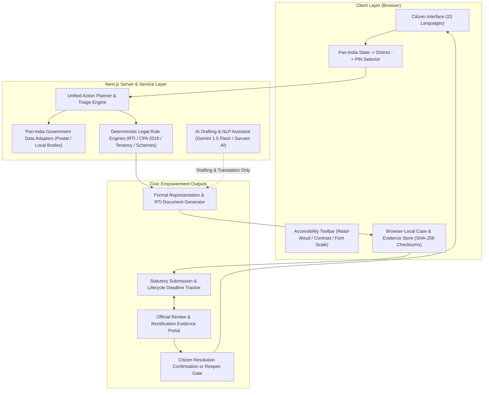

# InfoRight AI — Civic & Legal Empowerment Platform

> **Problem Statement**: *AI for Civic and Legal Empowerment*
>
> **Mission**: *InfoRight AI takes a citizen from a civic or legal problem to a source-grounded action and tracks that action until citizen-confirmed resolution.*
>
> 🌐 **Live Prototype**: [`https://inforight-ai.vercel.app`](https://inforight-ai.vercel.app)
>
> 💻 **GitHub Repository**: [`https://github.com/ammuelsa17-ui/inforight-ai`](https://github.com/ammuelsa17-ui/inforight-ai)
>
> 🎥 **Demo Video**: *[Add final video link here]*
>
> 🏛️ **Architecture**: *[Architecture diagram below & repository assets]*

---

## 1. How It Works

```
Citizen Problem
       │
       ▼
Understand & Clarify (Natural Language / Voice)
       │
       ▼
Location Context (Pan-India State → District → PIN)
       │
       ▼
Authority / Legal Routing (Rule-Based & Source-Grounded)
       │
       ▼
Formal Action & Document (Civic Representation / RTI / Notice)
       │
       ▼
Lifecycle Tracking (30-Day Statutory Deadlines & Milestones)
       │
       ▼
Officer Rectification Evidence (Photographic Proof & Work Orders)
       │
       ▼
Citizen Confirmation or Reopening (Citizen-Only Platform Closure)
```

InfoRight AI provides a structured, multi-stage civic journey: a citizen describes an everyday issue in natural text or voice, the system establishes territorial and administrative context across India's 36 States and UTs, derives the appropriate civic and statutory route, drafts formal representation and RTI documents with verified legal citations, tracks statutory response deadlines, and enforces closed-loop accountability where citizens inspect photographic rectification evidence before confirming resolution or reopening the matter.

---

## 2. Why InfoRight AI is Different

| Dimension | Typical Information / Chatbot Systems | InfoRight AI Empowerment Architecture |
| :--- | :--- | :--- |
| **Workflow Scope** | Question $\rightarrow$ Text Answer $\rightarrow$ Process ends | Problem $\rightarrow$ Verified Action $\rightarrow$ Document $\rightarrow$ Track $\rightarrow$ Officer Evidence $\rightarrow$ Citizen Confirmation / Reopen |
| **Legal Grounding** | LLM generates legal advice directly (prone to hallucination) | **Non-Delegation Boundary**: LLM assists with language & drafting; deterministic rule engines enforce statutes, deadlines, and authority routing |
| **Civic vs. RTI Distinction** | Conflates RTI as a direct complaint box | Clarifies **Primary Civic Action** (grievance to municipal body) vs. **Secondary RTI Action** (records, MB entries & contractor defect liability) |
| **Resolution Sovereignty** | Bureaucratic portal marks ticket "Resolved" unilaterally | **Citizen Sovereignty**: The citizen retains final platform control to **Confirm Resolution** or **Reopen Case** |
| **Multilingual Access** | Single language or raw machine translation | **23 Interface Languages** (English + 22 Scheduled Indian Languages) with automated structural, script, and English-leakage validation |

---

## 3. Platform Architecture



---

## 4. AI / Deterministic Logic Boundary

InfoRight AI enforces a strict architectural boundary between probabilistic language models and deterministic legal rules:

> **"Legal and authority outcomes are source-grounded and rule-driven; the LLM is not allowed to invent jurisdiction or statutory facts."**

* **AI Capabilities**:
  - Natural language interpretation of conversational citizen problem statements.
  - Multi-dialect translation across Bharat languages.
  - Plain-language simplification of legal terminology.
  - Drafting assistance for contextual factual narratives.
* **Deterministic Rule Engine Capabilities**:
  - **Statutory Deadlines**: Sections 6(3), 7(1) [30-day response], and 19(1) of the RTI Act 2005.
  - **Consumer Jurisdiction**: Pecuniary ceilings under CPA 2019 (District Commission up to ₹50 Lakhs, State Commission ₹50 Lakhs–₹2 Crores, National Commission >₹2 Crores) and direct routing to **e-Jagriti** and National Consumer Helpline (**1915**).
  - **State Tenancy Rules**: State-specific enacted rent legislations (e.g. TNRRRLT Act 2017, Karnataka Rent Act 1999) while explicitly framing the Model Tenancy Act 2021 as a guidance framework.
  - **Welfare Eligibility**: Deterministic rule matching across 91 Central and State schemes (referencing the **myScheme** taxonomy).
  - **Verification Fallback**: When authority mapping or jurisdictional boundaries cannot be independently verified, the platform returns `VERIFICATION_REQUIRED` rather than guessing.

---

## 5. Location Architecture & Consistency

- **Pan-India Directory**: Comprehensive directory covering all 36 States and Union Territories with dynamic State $\rightarrow$ District dropdown filtering.
- **PIN-Based Context**: Resolves 6-digit Indian PIN codes to administrative localities, taluks, and responsible civic bodies.
- **Spatial Area Context**: Approximate postal-area boundary representation with device-reported location refinement.
- **Location Conflict Guard**: Haversine-based location-consistency checks and automated validation preventing contradictory State/District/PIN submissions before document generation.

---

## 6. Closed-Loop Rectification & Citizen Control

1. **Matter Submission**: Citizen creates a structured case record with localized facts and optional "before" condition photographs.
2. **Cryptographic Integrity**: Uploaded images and generated representations receive client-side **SHA-256 integrity checksums** to verify that documents and evidence files remain unaltered after generation.
3. **Official Review**: Municipal and administrative officers review pending citizen matters within their territorial scope and record remedial work orders.
4. **Rectification Proof**: Officers submit "after" rectification photographs.
5. **Citizen Platform Closure**: The platform requires the citizen to evaluate the rectification proof. The citizen retains platform closure sovereignty: **Confirm Resolution** or **Reopen Case**.

---

## 7. Multilingual Architecture across 23 Interface Languages

InfoRight AI supports **23 interface languages**: English + all 22 official languages listed in the Eighth Schedule of the Constitution of India:

| Language Family | Supported Languages |
| :--- | :--- |
| **Indo-Aryan** | Hindi (`hi-IN`), Bengali (`bn-IN`), Marathi (`mr-IN`), Gujarati (`gu-IN`), Punjabi (`pa-IN`), Odia (`od-IN`), Assamese (`as-IN`), Urdu (`ur-IN`), Maithili (`mai-IN`), Nepali (`ne-IN`), Sindhi (`sd-IN`), Konkani (`kok-IN`), Dogri (`doi-IN`), Sanskrit (`sa-IN`), Kashmiri (`ks-IN`) |
| **Dravidian** | Tamil (`ta-IN`), Telugu (`te-IN`), Kannada (`kn-IN`), Malayalam (`ml-IN`) |
| **Tibeto-Burman & Munda** | Bodo (`brx-IN`), Manipuri / Meitei (`mni-IN`), Santali (`sat-IN`) |
| **Global / Legal** | English (`en-IN`) |

- **Quality Validation**: Automated CI pipeline (`scripts/audit-locales-quality.ts`) tests all 22 non-English locale bundles against schema completeness, forbidden cross-script contamination, and English leakage.
- **Accessibility Integration**: Real-time text-to-speech read-aloud via Sarvam AI (`saaras:v3`), high-contrast viewing mode, and dynamic 3-tier font resizing (A- / A / A+).

---

## 8. Privacy-Conscious Prototype & Server-Side Credential Protection

- **Server-Side API Security**: All external API keys and cloud credentials (`GEMINI_API_KEY`, `SARVAM_API_KEY`) are protected within serverless route handlers and never exposed to the client bundle.
- **PII Shielding on RTI Flow**: Citizen identity fields (applicant name, physical address, contact details) remain strictly in browser memory and are blocked from transmission to external LLMs.
- **Data Minimization**: Text processing routes redact common phone numbers, email addresses, and Aadhaar-like number patterns from issue statements before server-side language operations.
- **Client-Side Case Persistence**: Case records, drafts, and evidence files reside securely in browser storage (`localStorage` / `IndexedDB`).

---

## 9. Technology Stack

| Component | Technology | Purpose |
| :--- | :--- | :--- |
| **Application Framework** | Next.js 16.3.1 (App Router, Turbopack) | Modern React Server Components & API routes |
| **UI Library** | React 19, Tailwind CSS v4, Lucide React | Clean, accessible, responsive civic interface |
| **Programming Language** | TypeScript 5 (Strict Mode) | Full-stack end-to-end type contracts |
| **AI & NLP Services** | Google Gemini 1.5 Flash, Sarvam AI (`saaras:v3`) | Natural language drafting & Indic voice processing |
| **Spatial Mapping** | Leaflet & OpenStreetMap | Browser-based contextual location viewer |
| **Storage & Security** | Web Crypto API (SHA-256), `localStorage` | Client-side integrity hashing and case persistence |
| **Hosting & CI** | Vercel Serverless Platform, GitHub Actions | Zero-downtime deployment and automated validation |

---

## 10. Automated Quality & Verification Suite

The repository contains an exhaustive automated test and validation harness:

* **383 / 383 API & Contract Tests Passed** (`npm run test:api` via `scripts/test-v2-api-contracts.ts`):
  - 100% route contract enforcement across all 15 government data, triage, RTI, schemes, rights, and language endpoints.
  - Grounding invariants, pecuniary limits, and statutory deadline verification.
* **22 / 22 Non-English Locale Quality Audits Passed** (`npx tsx scripts/audit-locales-quality.ts`):
  - Validates key parity (447 keys per locale), zero missing keys, zero forbidden scripts, and strict English leakage prevention.
* **Next.js Production Build**: Clean static generation across 35 application routes.

```bash
# Execute full validation suite locally
npm run test:api
npx tsx scripts/audit-locales-quality.ts
npm run build
```

---

## 11. Known Prototype Limitations

1. **Browser-Local Persistence**: In this prototype, case files and evidence records are stored in client-side storage. A production deployment would integrate a secure, multi-tenant cloud datastore.
2. **Voice Hardware Dependency**: Automated suites validate speech API bindings and locale codes; physical voice input requires browser microphone hardware permission.
3. **Official Data Scope**: Pan-India legal statutes and administrative registries cover core national workflows and detailed municipal mappings (e.g. CCMC); remaining regional sub-bodies continue to expand.
4. **Machine-Assisted Localization**: While automated structural and script validation runs across all 22 non-English locales, localized copy is machine-assisted and curated for prototype evaluation rather than government-certified translations.

---

## 12. Submission Resources

* **Live Prototype**: [`https://inforight-ai.vercel.app`](https://inforight-ai.vercel.app)
* **GitHub Repository**: [`https://github.com/ammuelsa17-ui/inforight-ai`](https://github.com/ammuelsa17-ui/inforight-ai)
* **Video Demonstration**: *[Add final video link here]*
* **Implementation Contract**: [`docs/implementation-handoff-v1.0.md`](docs/implementation-handoff-v1.0.md)
* **API Specification**: [`docs/api-contract.md`](docs/api-contract.md)

---

## 13. Legal Disclaimer

*InfoRight AI is an educational, civic, and legal literacy platform. It provides structured draft applications and navigational information grounded in publicly available statutes and official government portals. It does not provide legal representation or create an attorney-client relationship. Citizens should independently verify filing procedures with competent authorities.*
