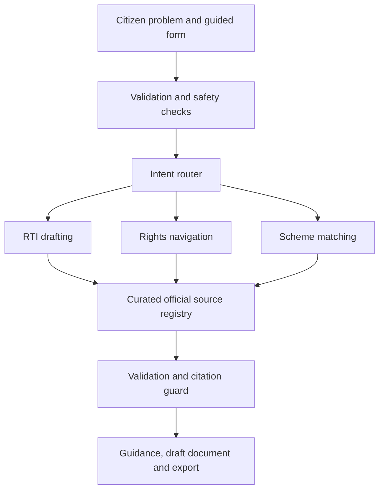

# InfoRight AI — System Architecture Overview

> **Target Version 2.0 Architecture**: Verified Source-Grounded Architecture for Civic and Legal Empowerment.

---

## 1. System Objective

InfoRight AI converts ordinary plain-language municipal road complaints, consumer disputes, tenancy issues, workplace grievances, and welfare queries into structured, actionable, record-based requests and representation letters using verified official government source records.

Rather than relying on unstructured AI text generation or subjective grievances, InfoRight AI enforces a strict privacy boundary, deterministic authority matching, server-side citation allowlisting, and guaranteed fallback response handling.

---

## 2. Target Version 2.0 System Architecture & Data Flow

---

## 3. Module Responsibilities & System Boundaries

* **RTI Drafting Agent**: Gemini (`gemini-1.5-flash`) drafts objective record-based questions; authority selection (`Public Information Officer`), verification status, and citation allowlisting remain strictly deterministic.
* **Rights Navigator**: Provides simple-language procedural steps, evidence checklists, and escalation pathways (e.g., National Consumer Helpline 1915, **e-Jagriti**, **SAMADHAN 2.0**) combined with explicit state-jurisdiction warnings. Gemini simplifies legal explanations but does not alter escalation rules.
* **Scheme Eligibility Reader**: Rule-based matching engine evaluating eligibility strictly against deterministic rules (referencing **myScheme** framework). Gemini explains matching reasons but does not decide eligibility.
* **Conversational Form-Filler**: Asks guided questions one at a time to auto-populate draft RTI applications, representation letters, or scheme checklists.
* **Official Source Transparency**: Resolved exclusively from Mithun's curated source registry (`src/data/sources/`). AI is prohibited from inventing government URLs or verification dates.

---

## 4. Privacy Boundary Architecture

InfoRight AI enforces a hybrid client-server privacy boundary to prevent personal applicant data from reaching external AI services:

### Browser-Only Data (Never Sent to API or AI):
* `applicantName`
* `applicantAddress`
* `phoneNumber`
* `email`
* `signature`

> **Applicant Identity Separation**: Personal applicant details remain strictly in local browser memory. They are injected client-side into the document template only during preview rendering and PDF/print export.

### Server-Side Privacy & Safety Safeguards:
* **Strict Request Schema Parsing**: Rejects any request containing prohibited personal data keys (`applicantName`, `applicantAddress`, etc.) before processing.
* **In-Text PII Redaction**: Scans input text for phone numbers (`[REDACTED_PHONE]`), email addresses (`[REDACTED_EMAIL]`), and Aadhaar-like number patterns (`[REDACTED_AADHAAR]`).
* **Fail-Safe Fallback**: If personal data cannot be safely redacted, the server aborts the AI call and immediately triggers deterministic fallback mode.
* **Privacy Indicator**: `validation.applicantDataSentToAI` is explicitly set to `false` in every response.

---

## 5. Engineering Foundation & Quality Controls

| Category | Control Status | Implementation Details |
| :--- | :---: | :--- |
| **Development** | ✓ Implemented | GitHub feature branches & pull-request review isolation (`AGENTS.md`). |
| **Testing** | ✓ Implemented □ Pending | ✓ Lint (`npm run lint`), ✓ Production build (`npm run build`). □ Unit tests, □ API contract tests, □ End-to-end smoke tests. |
| **Deployment** | ✓ Implemented | Vercel production hosting (`https://inforight-ai.vercel.app`) with server-side environment variables. |
| **Security & Reliability** | ✓ Implemented | Server-side API key (`GEMINI_API_KEY`), applicant identity excluded from AI request payload, citation allowlist, deterministic fallback mode. |
| **Observability** | ✓ Implemented □ Pending | ✓ Vercel runtime logs. □ Structured error tracking. |

---

## 6. Known Prototype Limitations & Boundaries

* **Verified Scope**: Official authority verification is curated specifically for Coimbatore City Municipal Corporation. Authorities outside verified coverage display an unverified status warning.
* **Manual Portal Submission**: InfoRight AI formats applications for manual filing (print, copy, PDF export). Automatic government portal submission is excluded.
* **Zero Persistence**: No user accounts, authentication, application history, or database storage.
* **No Vector DB / RAG**: No vector database, Supabase pgvector, or general RAG pipelines are used.
* **No Media Assets**: Image uploads, video processing, and geolocation services are outside Phase 1 prototype scope.
