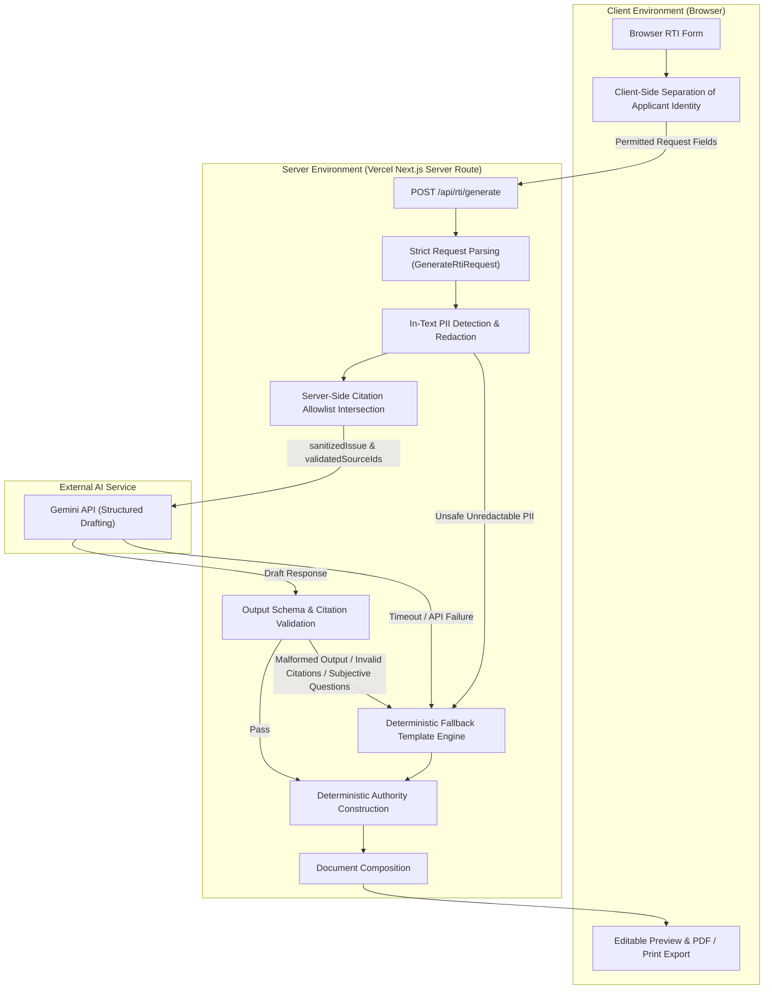
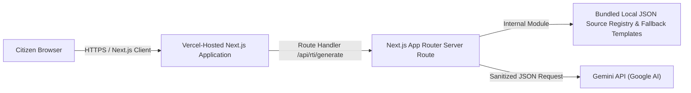

# InfoRight AI — System Architecture Overview

## 1. System Objective

InfoRight AI converts ordinary plain-language municipal road complaints into structured, legally aligned, record-based Right to Information (RTI) applications using verified official government source records.

Rather than relying on unstructured AI text generation or subjective grievances, InfoRight AI enforces a strict privacy boundary, deterministic authority matching, server-side citation allowlisting, and guaranteed fallback response handling.

---

## 2. System Architecture & Data Flow

---

## 3. Privacy Boundary Architecture

InfoRight AI enforces a hybrid client-server privacy boundary to reduce the risk of exposing applicant personal data to the AI service:

### Browser-Only Data (Never Sent to API or AI):
* `applicantName`
* `applicantAddress`
* `phoneNumber`
* `email`
* `signature`

> **Applicant Identity Separation**: Personal applicant details remain strictly in local browser memory. They are injected client-side into the document template only during preview rendering and PDF/print export.

### Civic Request Received by the Server

The browser sends only the civic fields permitted by `GenerateRtiRequest`:

* `issue`
* `state`
* `district`
* `localBodyName`
* `locality`
* `ward` (optional)
* `dateRange` (optional)
* `sourceIds` (untrusted client input)

The server then derives:

* `sanitizedIssue` after in-text PII detection and redaction.
* `validatedSourceIds` after intersecting `sourceIds` with the official server-side allowlist.

Only the sanitized and validated values may be included in the Gemini prompt.

### Server-Side Privacy Protections:
* **Strict Schema Parsing**: Rejects any request containing prohibited or unknown keys before processing.
* **In-Text PII Redaction**: Scans issue text for phone numbers, email addresses, and Aadhaar-like numbers, redacting detected patterns.
* **Fail-Safe Fallback**: If suspected personal data cannot be safely redacted, the server aborts the AI call and immediately triggers deterministic fallback mode.
* **Privacy Indicator**: `validation.applicantDataSentToAI` is explicitly set to `false` in every response.

---

## 4. Deterministic Responsibilities

To improve reliability, predictability, and reduce hallucination risk, the following components are executed **deterministically outside Gemini**:

* **Public Authority Construction**: Constructed strictly from normalized state and local body names (`designation: "Public Information Officer"`, `organization`, `state`, `verified`).
* **Verification Status**: Coimbatore authorities matched against curated source registries are marked `verified: true`; other authorities are marked `verified: false` with a verification warning.
* **Official Citation URLs**: Resolved exclusively from server-side source records.
* **Fees and Legal Procedure Claims**: Never generated by Gemini. Phase 1 displays only curated, verified information when available; otherwise the interface asks the citizen to confirm it through the responsible authority.
* **Fallback Activation**: Triggered deterministically on API error, timeout, malformed JSON, invalid citations, subjective questions, or unsafe PII.

---

## 5. Gemini AI Responsibilities

Gemini functions strictly as a structured drafting assistant and generates **only** these four fields:

1. `subject`: Concise, formal RTI application subject title.
2. `applicationBody`: Short, objective context statement describing the civic road issue.
3. `questions`: Array of **3 to 5 record-based requests** for existing government records.
4. `citationIds`: Array of citation IDs selected strictly from `validatedSourceIds`.

> **Prohibited AI Decisions**: Gemini never determines public authority details, verification status, RTI fees, legal sections, official URLs, or applicant identity details. Gemini is prohibited from generating subjective questions (e.g., "Why was the road not repaired?").

---

## 6. Reliability Path & Fallback Engine

InfoRight AI provides a usable document path through two execution modes:

### 1. Normal AI Mode (`mode: "ai"`)
Activated when Gemini returns valid JSON matching the response schema, containing 3–5 record-based questions, and referencing only allowlisted citation IDs.

### 2. Deterministic Fallback Mode (`mode: "fallback"`)
Activated automatically if:
* Gemini API times out or fails (HTTP 5xx / 429).
* Gemini output fails schema parsing or JSON validation.
* Gemini returns invalid or non-allowlisted citation IDs.
* Gemini generates subjective or non-record questions.
* Unsafe personal information is detected in input and cannot be safely redacted.

Fallback responses return predetermined record-based questions defined in the fallback template for road inspection, estimates, Measurement Book (MB) entries, expenditure statements, and complaint registers using stable source citations.

---

## 7. Official Source Registry

Phase 1 uses curated official source records identified by stable IDs:

* `RTI_ACT_2005_AMENDED`: Right to Information Act 2005 (National legislation reference).
* `CCMC_RTI_AUTHORITY`: Coimbatore City Municipal Corporation RTI authority page.
* `CCMC_ENGINEERING_ROADS`: Coimbatore City Municipal Corporation Engineering Department page describing road-related functions.

---

## 8. Deployment Architecture

* **Environment Safety**: `GEMINI_API_KEY` is configured strictly in Vercel Environment Variables.
* **Bundled Local Registry**: Source registries and fallback templates reside inside the application bundle, eliminating external database dependencies.

---

## 9. Known Phase 1 Limitations

* **Geographic Scope**: Official authority verification is curated specifically for Coimbatore City Municipal Corporation. Other authorities display an unverified status warning.
* **Manual Portal Submission**: InfoRight AI formats applications for manual filing (print, copy, PDF export). Automatic government portal submission is excluded.
* **Zero Persistence**: No user accounts, authentication, application history, or database storage.
* **No Vector DB / RAG**: No vector database or general RAG pipelines are used.
* **No Media Assets**: Image uploads, video processing, and geolocation services are outside Phase 1 scope.
